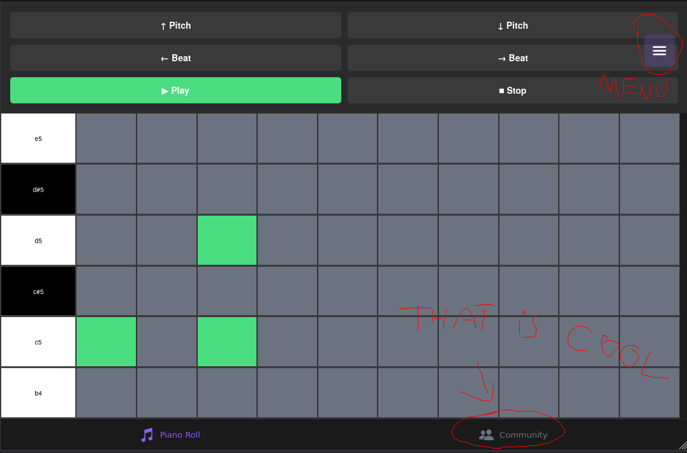
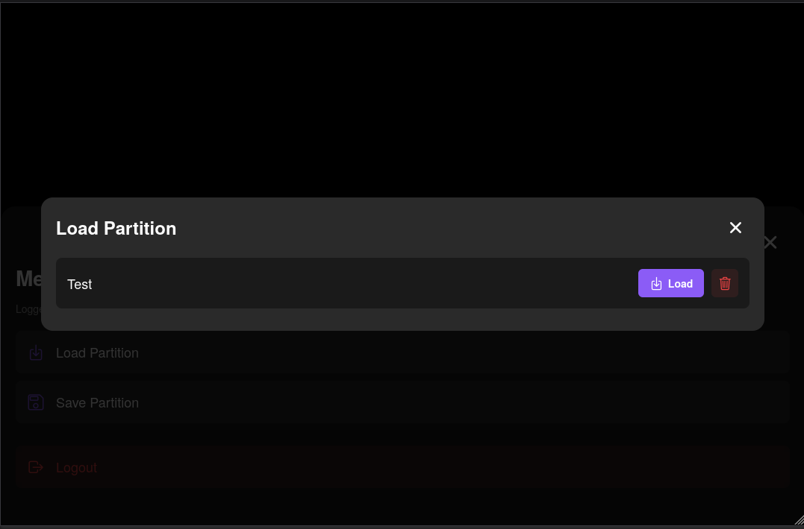
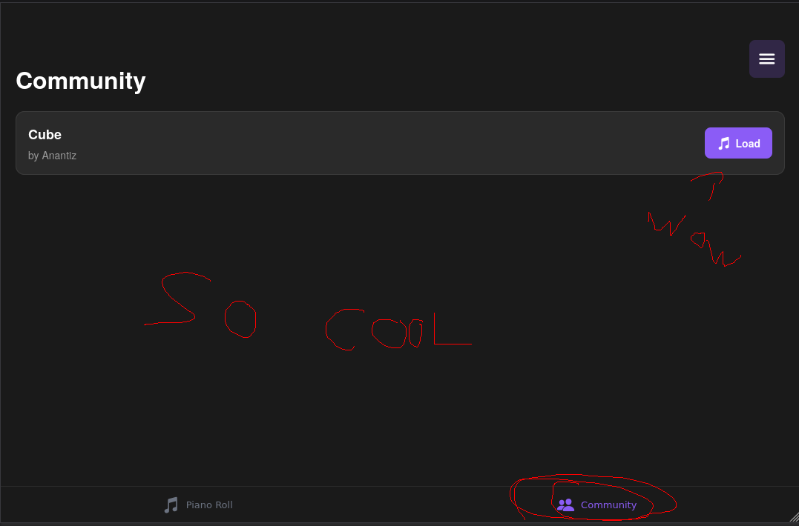

# Midi-Roll-Share 🎹

**POV: You love David so you make an app to share melody drafts together**

## Preface:

**I made this project over the weekend to:**

- Learn the modern TypeScript + mobile developer stack
- Experience the whole Convex + Expo + Vercel pipeline
- Demonstrate that I am, in fact, **Lightning McQueen *(KACHOW)***

## Stack Overview:

**Backend**: Uses Convex

**Frontend**: Uses Expo

**Deployment**:
- **Backend:** Expo-cloud
- **Web Build:** Vercel ***[(test it live)](https://piano-roll-rust.vercel.app/) 📍***
BEFORE CLIKCING ON THIS: The loading takes like 30seconds (sorry), and you will need to Register an account, juste use something like username=John1 password=abcd
I ain't *fixing* the project in order to keep the "Over a weekend" truthful 

## Execution plan:

1. Learn Convex
2. Learn Expo and React-Native
3. Struggle
4. Deploy
5. Profit 🥺👉👈

## The app features:

- Interactive **piano roll** — tap to write a beat, long-press to erase

- **Shareable projects** between users

- **User authentication** and persistence via Convex

- *“Advanced”* audio processing (translation: it works, mostly)

- **Cross-platform** builds (Web / iOS / Android)

- UX/UI so bad it could land me in **jail**

- A **dogshit** asset loader that takes roughly 30 seconds to load piano samples

## Technical Outline

- Wrestled with **audio APIs**: expo-av, expo-audio, and the Web Audio API

- Debugged **file-loading** differences between native and web (filesystem abstraction hell)

- Learned how asset bundling and TypeScript runtime/build-time resolution interact

- Implemented a manual **arena allocator in TypeScript** (because why the fck not?)

- **Investigated** cross-platform audio latency, buffering, and rendering constraints *(strong emphasis on "Investigated")*

- Documented the entire mental collapse in devlogs.md

## Skills & Lessons Learned

- Full-stack TypeScript familiarity (frontend + backend + build tooling)

- Audio synthesis, scheduling, and timing precision on web vs native

- Mobile deployment flow (Expo EAS + Vercel + Convex Cloud)

- Unmatched industry skills in VibeCoding

### App Guide: (Web demo)
___

___

___

